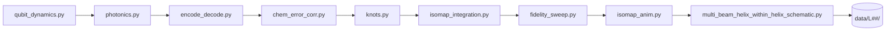

<p align="center">
  
</p>

# Vortex Quaternion Conduit (VQC) — OAM Simulations

Ultra-high-density quantum data compression and transfer via OAM-flux qubits and quaternion encoding.

[](https://github.com/kinaar8340/vqc_proto)
[](https://huggingface.co/spaces/kinaar111/orbital-braille-vqc)
[](https://github.com/kinaar8340/vqc_sims_public)

> **IP notice:** CC-BY-NC-SA-4.0 + patent restrictions — see [`IP_NOTICE.md`](IP_NOTICE.md) before commercial use.

---

## Try the live demo (zero install)

**[🤗 Hugging Face Space — Orbital Braille VQC Typehead](https://huggingface.co/spaces/kinaar111/orbital-braille-vqc)**

Run the prototype in your browser — no clone required. The live app includes:

| Feature | What it does |
|---------|----------------|
| **One-click presets** | Patent Fig. 1, VQC prototype, Hello OAM, 6-orb stress — each loads settings and **runs** the pipeline |
| **Channel noise slider** | Tune turbulence strength (0 = clean link, 1 = harsh) without rerolling seed |
| **γ₁ (BMGL) slider** | Live p-wave inhibition strength vs. phase noise |
| **6-panel figure** | Encode → turbulence → decode visualization + metrics |
| **Interactive 3D (Plotly)** | Drag/zoom orb helices in (x, y, time); hover for PWM on/off |
| **Animate typehead** | Per-run MP4 + GIF (phase · intensity · pulse · orb trails) |
| **SLM package zip** | `manifest.json`, `phase_stack.npy`, bench README — optional PNG frame export locally |
| **In-app 60s guide** | Selectric typeball analogy, pipeline steps, metrics glossary |

**New to OAM or the typeball analogy?** The Space README includes a [beginner guide](https://huggingface.co/spaces/kinaar111/orbital-braille-vqc/blob/main/README.md) with diagrams, OAM comparisons, and an animated typehead walkthrough ([`typehead_demo.gif`](typehead_demo.gif) · [`docs/typehead_screencast.mp4`](docs/typehead_screencast.mp4)).

Maintainers: `./scripts/sync_hf_space.sh` then `./scripts/deploy_hf_space.sh` (SSH git to HF, or `export HF_TOKEN=hf_...` for hub upload).

---

## Try the Orbital Braille Prototype in < 5 minutes

Most visitors want the **VQC Typehead / Orbital Braille** demo first. Four ways in:

### Option A — Live web demo (recommended)

Open the **[Hugging Face Space](https://huggingface.co/spaces/kinaar111/orbital-braille-vqc)** or run locally:

```bash
cd proto && pip install -r requirements-web.txt && python gradio_demo.py
# → http://localhost:7860
```

### Option B — Docker (zero local setup)

```bash
git clone https://github.com/kinaar8340/vqc_proto.git && cd vqc_proto
docker compose run --rm proto-quick
```

Output lands in `proto/outputs/orbital_braille_demo.png`.

### Option C — Quick mode (seconds, local Python)

```bash
git clone https://github.com/kinaar8340/vqc_proto.git && cd vqc_proto/proto
python3 -m venv .venv && .venv/bin/pip install -r requirements.txt
.venv/bin/python run_demo_quick.py --payload "I live in Oregon" --num-orbs 4
```

### Option D — Full-quality demo (~1 min)

```bash
.venv/bin/python run_demo.py --payload "I live in Oregon" --num-orbs 4
```

Reproduces the validated metrics below (Fisher-Rao **0.989 rad**, shard FID **0.929**).


**Next steps:** [`proto/README.md`](proto/README.md) · [`GLOSSARY.md`](GLOSSARY.md) · [`proto/SLM_QUICKSTART.md`](proto/SLM_QUICKSTART.md) · [`ROADMAP.md`](ROADMAP.md) · Jupyter [`proto/notebooks/orbital_braille_demo.ipynb`](proto/notebooks/orbital_braille_demo.ipynb)

**Web demos:** `./scripts/run_gradio_local.sh` or `python proto/gradio_demo.py` (port 7860 — same UI as HF Space) · `streamlit run analysis/dashboard.py` (proto tab auto-loads latest output)

**Full VQC pipeline** (1–2 h at `L_max=199`): `python run_all.py` · smoke test: `python run_all.py --quick` (`L_max=15`)

---

> **Sibling repository** of [vqc_sims_public](https://github.com/kinaar8340/vqc_sims_public) (GitHub does not allow self-forks). Contains the full VQC simulation suite plus the **Orbital Braille** prototype in [`proto/`](proto/).

The **Vortex Quaternion Conduit (VQC)** is a hybrid classical–quantum optical communication architecture that multiplexes data into orthogonal orbital angular momentum (OAM) modes per DWDM channel, compresses payload shards via quaternion hypercomplex encoding, and propagates them through nested helical phase structures with Beam-Motion-Gated Learning (BMGL) and 16-qubit QEC for turbulence-resilient recovery. Full specification: [VQC Non-Provisional Application (draft)](https://github.com/kinaar8340/qvpic/blob/main/docs/VQC_NonProvisional_Patent_Application.md) · provisional US 63/913,110.

**Public release:** Phase 1.2.93 (Nov 27, 2025) — **COMPLETE**  
**Orchestrator:** `run_all.py` v1.2.91 Ω  
**Patent:** US provisional 63/913,110 (filed Oct 28, 2025) · Amendments Nov 15, Nov 26, Nov 27, 2025

---

## Overview

This repository simulates the full VQC photonic–quantum pipeline: quaternion-encoded shards, OAM mode propagation through nested helical beams, overcomplete ICA demixing, and 16-qubit quantum error correction (QEC).

| Capability | Detail |
|---|---|
| QEC mode | 16-qubit canonical (8- and 4-qubit modes deprecated) |
| OAM horizon | `L_max = 199` validated; `L_inner ≤ 1999` stability cap |
| Channels | `2 × L_max + 1` orthogonal OAM modes + quaternion layer |
| Default config | `configs/params.yaml` · `QEC_LEVEL=16` set by orchestrator |

Pre-generated simulation archives under `data/L199/` are not included in this repository (withheld for patent enablement). All pipeline code is present — run locally to reproduce figures, CSVs, and PDFs.

---

## Orbital Braille Prototype (`proto/`)

**New in this repository:** a working end-to-end simulation of the **VQC Typehead / Orbital Braille** embodiment.

*N* co-rotating, PWM-gated point sources whose interference imprints **pyramidal spectral shards** onto an OAM/quaternion carrier.  
Concept: IBM Selectric typeball meets optical Braille — orbital phases + duties select the glyph; the far-field interference pattern is the "paper impression."

### Latest validated demo (4 orbs)

**Command:** `.venv/bin/python run_demo.py --payload "I live in Oregon" --num-orbs 4`

| Metric | Value |
|--------|-------|
| Payload | `"I live in Oregon"` (patent Figure 1) |
| Encoded quaternion | w=0.428, x=0.188, y=0.634, z=0.616 |
| Fisher-Rao font separation | **0.989 rad** |
| Shard fidelity (post-BMGL) | **0.929** (Pearson) |
| Glyph match | index **2**, fidelity **0.868** |
| p-wave BMGL | γ₁ = 1.5, inhibition boost ≈ 1.167× |


*Six-panel output: clean helical phase → p-wave BMGL turbulence → intensity (OAM donut + orbital Braille lobes) → pyramidal FM pulse → Welch spectral shards → typehead orb positions (ℓ labels + PWM duties).*

**Technical documentation & module reference:** [`proto/README.md`](proto/README.md) — typeball mapping, encoding pipeline, patent claim table, future work.

### Quick start (4-orb prototype)

```bash
git clone git@github.com:kinaar8340/vqc_proto.git
cd vqc_proto/proto

python3 -m venv .venv && .venv/bin/pip install -r requirements.txt

# Seconds — low-res smoke test
.venv/bin/python run_demo_quick.py --payload "I live in Oregon" --num-orbs 4

# Full quality — reproduces metrics above
.venv/bin/python run_demo.py --payload "I live in Oregon" --num-orbs 4

# Compare orb counts (2–6)
.venv/bin/python sweep_orbs.py

# Optional: grid search over orbs × γ₁ × r₀ + SLM hologram export
.venv/bin/python meta_optimize_orbital.py
.venv/bin/python generate_slm_holograms.py --num-orbs 4
```

**Docker:** `docker compose run --rm proto-quick` from repo root.

### Orb count trade-off (current results)

| Orbs | Fisher-Rao separation | Shard fidelity | Glyph fidelity | Recommendation |
|------|----------------------|----------------|----------------|----------------|
| 2 | 0.787 rad | 0.937 | **0.999** | Highest decode accuracy, limited alphabet |
| **4** | **0.989 rad** | **0.929** | 0.868 | **Prototype sweet spot — best balance** |
| 6 | 1.027 rad | 0.920 | 0.804 | Higher capacity, increased demux difficulty |

### Why 4 orbs is the current prototype choice

- Near-ideal codeword separation (~1 rad geodesic distance on the PWM duty simplex)
- **>92% shard recovery** after realistic turbulence (Kolmogorov + pointing jitter + p-wave BMGL)
- Natural mapping to a **4-dot extended Braille cell**
- Directly implementable on **SLM** (virtual orbits, no mechanics) or a simple rotating 4-laser array
- Aligns with VQC claims: pyramidal FM pulses, spectral shard encoding, quaternion rotation, p-wave BMGL robustness

### Reduction to practice & patent enablement

This simulation constitutes **reduction-to-practice** of the multi-orb point-source mechanism for generating and recovering pyramidal spectral shards on an OAM carrier — a distinct embodiment supporting the VQC non-provisional (Docket VQC-2025-NP01) and supplemental disclosures (Nov 15–27, 2025).

| Enablement element | Where implemented |
|--------------------|-------------------|
| Pyramidal FM pulse → spectral shards | `proto/orbital_braille/typehead.py` + Welch PSD in `proto/run_demo.py` |
| Quaternion shard compression | `quaternion_codec.py` (Rodrigues-compatible) |
| OAM Laguerre-Gaussian carrier | `lg_modes.py` |
| Stable codeword font (emergent constants) | `stable_fonts.py` (350/π, κ, braiding 0.084) |
| p-wave BMGL error inhibition | `altermagnetic.py` (γ₁ = 1.5) |
| SLM virtual typehead (no moving parts) | `proto/orbital_braille/slm_typehead.py`, `proto/generate_slm_holograms.py` |

> **Provenance:** Developed June 2026 as sibling repo [`vqc_proto`](https://github.com/kinaar8340/vqc_proto), extending [`vqc_sims_public`](https://github.com/kinaar8340/vqc_sims_public). Reproducible via `proto/run_demo.py` with fixed seed (42). Full claim mapping in [`proto/README.md`](proto/README.md).

**SLM virtual typehead (ready):** [`proto/SLM_QUICKSTART.md`](proto/SLM_QUICKSTART.md) · `python proto/generate_slm_holograms.py --device holoeye_pluto_2`

**Future work (high priority):** SLM bench validation · `meta_optimize_invariants.py` integration · fs-laser helical masks + laser array PoC.

---

## Quick Start

### 1. Install

```bash
git clone https://github.com/kinaar8340/vqc_proto.git
cd vqc_proto
python3 -m venv .venv && source .venv/bin/activate
pip install -r requirements.txt
```

**Requirements:** Python 3.10+ · tested on a 72-core PowerEdge R630; scales down on consumer hardware with reduced `L_max`.

### 2. Run the full pipeline

```bash
# Smoke test (~minutes): L_max=15
python run_all.py --quick

# Recommended: respects params.yaml, parallel Isomap, auto-archives to data/L199/
OMP_NUM_THREADS=16 python run_all.py

# Override OAM horizon via environment (propagates to all pipeline stages)
VQC_L_MAX_OVERRIDE=199 OMP_NUM_THREADS=16 python run_all.py

# Extended sims at L_inner=1999 (expect ~4–6 h on 72-core hardware)
VQC_L_MAX_OVERRIDE=1999 OMP_NUM_THREADS=16 python run_all.py
```

`run_all.py` executes every stage in order, archives transient `outputs/` to `data/L{final_l}/`, and prints a summary banner on completion.

**Runtime estimates (72-core node):**

| `L_max` | Approx. time |
|---|---|
| 199 | 1–2 hours |
| 1999 | 4–6 hours |

### 3. Run tests

```bash
pytest -q
```

### 4. Explore results (optional)

```bash
streamlit run analysis/dashboard.py
# or via Docker:
docker compose up dashboard   # http://localhost:8501
```

The dashboard auto-detects the highest `data/L##/` archive and renders figures, tables, GIFs, and PDF summaries. Proto demo output: `proto/outputs/orbital_braille_demo.png`.

---

## Pipeline



| Stage | Module | Role |
|---|---|---|
| Qubit dynamics | `src/qubit_dynamics.py` | Single- and multi-mode OAM-flux Lindblad evolution under 16-qubit QEC |
| Photonics | `src/photonics.py` | Vectorized helical-beam propagation with nested shielding |
| Encode / decode | `src/encode_decode.py` | Quaternion encoding, BMGL / p-wave gating, ICA demixing, diagnostic plots |
| Chemical QEC | `src/chem_error_corr.py` | Chemical error correction with p-wave altermagnetic boosts (γ₁ = 1.5) |
| Topology | `src/knots.py` | Stevedore 8₃ knot protection |
| Manifold embed | `src/isomap_integration.py` | Isomap embeddings with batch stress reporting |
| Fidelity sweep | `analysis/fidelity_sweep.py` | Infidelity sweep (floored at 1e⁻¹⁸ for visualization) |
| Animation | `analysis/isomap_anim.py` | 3D Isomap evolution GIFs |
| Schematic | `src/multi_beam_helix_within_helix_schematic.py` | Multi-beam "helix-within-a-helix" schematics |

**Supporting modules:** `src/demixing.py` (ICA recovery) · `analysis/dashboard.py` (Streamlit viewer) · `analysis/roemmele_proxy_viz.py` (interactive HTML proxy)

**Outputs** land in `outputs/` during a run, then archive to `data/L{final_l}/` with CSVs, PNG figures, GIFs, and PDFs.

---

## Configuration

### `configs/params.yaml`

Single source of truth for simulation parameters. Key fields:

```yaml
qubit_multi:
  L_max: 199          # OAM horizon (primary knob)
photonics:
  lambda_nm: 1550.0   # Wavelength
  N: 512              # Grid resolution
demix:
  n_components: 8
  n_samples: 12000
```

### `L_max` resolution order

Each module resolves the effective OAM horizon as:

1. `VQC_L_MAX_OVERRIDE` environment variable (set automatically by `run_all.py`)
2. `--L_max` / `--l_max` CLI flag (per-script)
3. `configs/params.yaml` → `qubit_multi.L_max`
4. Built-in default (25)

`run_all.py` sets `final_l = max(199, highest_existing_data/L##/)` and exports it as `VQC_L_MAX_OVERRIDE`.

### Environment variables

| Variable | Default | Purpose |
|---|---|---|
| `QEC_LEVEL` | `16` | QEC width (set by orchestrator) |
| `VQC_QEC_16QUBIT` | `true` | Enable 16-qubit suppression |
| `VQC_L_MAX_OVERRIDE` | from orchestrator | OAM horizon override |
| `OMP_NUM_THREADS` | system default | OpenMP thread count for NumPy/SciPy |

---

## Achieved Metrics (Phase 1.2.93, representative)

Locally generated reference values at `L_max = 199`:

| Metric | Value |
|---|---|
| Global gate fidelity | 0.9992 (multi-beam, L_outer = 3, L_inner = 1999) |
| Chemical QEC fidelity | 0.9999912711 (α ≈ 0.001751) |
| Topological protection | Stevedore 8₃ knot — fidelity 1.000000 |
| Isomap stress | 0.0133 (3D embedding, k = 20; batch mean across 5 embeddings) |
| Demixing post-FID | > 99.92% (overcomplete ICA; intensity / phase offsets 0.110 / −0.002) |
| Quaternion compression | Up to 4.6875 × 10⁹ (scales with ℓ; example: q(0.590 + 0.402i + 0.628j + 0.309k)) |
| Infidelity sweep floor | ≤ 4.046 × 10⁻¹¹ (enforced at 1e⁻¹⁸ for plots) |
| Batch yield | 100% · pytest suite passing |

**New in 1.2.93:** p-wave altermagnetic BMGL boosts (γ₁ = 1.5), NUMA-optimized multiprocessing in Isomap stages, and updates to `encode_decode.py`, `photonics.py`, and `chem_error_corr.py`. Yields 33–50% error-suppression boosts and extended T₂ coherence > 222 μs.

---

## Project Structure

```
vqc_sims_public/
├── run_all.py              # Master orchestrator
├── configs/
│   └── params.yaml         # Canonical parameters
├── src/
│   ├── qubit_dynamics.py
│   ├── photonics.py
│   ├── encode_decode.py
│   ├── chem_error_corr.py
│   ├── knots.py
│   ├── demixing.py
│   ├── isomap_integration.py
│   └── multi_beam_helix_within_helix_schematic.py
├── analysis/
│   ├── fidelity_sweep.py
│   ├── isomap_anim.py
│   ├── dashboard.py
│   └── roemmele_proxy_viz.py
├── tests/                  # pytest suite
├── outputs/                # Transient run artifacts (gitignored)
└── data/                   # Archived results data/L##/ (gitignored)
```

---

## Running Individual Stages

```bash
# Standalone chemical QEC with CSV export
python src/chem_error_corr.py --L_max 199

# Fidelity sweep with CSV output
python analysis/fidelity_sweep.py --save_csv

# Isomap animation (60 frames)
python analysis/isomap_anim.py --n_frames 60

# Multi-beam schematic at extended inner OAM
python src/multi_beam_helix_within_helix_schematic.py --L_inner 1999
```

---

## Patent Alignment

| Amendment | Summary |
|---|---|
| **Nov 27** | Validated `L_max = 199` simulations with p-wave BMGL boosts (γ₁ = 1.5) and 16-qubit QEC across all modules. Mean gate fidelity 0.9992, chemical QEC 0.9999912711, knot fidelity 1.000000, Isomap stress 0.0133. Multi-beam architectures (L_inner = 1999) maintain > 99.92% end-to-end fidelity. |
| **Nov 26** | p-wave helical magnets for BMGL; atomic-scale spin helices with switchable orientation. Dynamic gating via SOC (λ = 0.4) and p-wave splitting (p = 1.2), inhibiting errors up to 8.88× at γ₁ = 1.5. |
| **Nov 15** | OAM-DWDM + Isomap guards claimed. |

**BMGL protocol:** OAM rotation (30–45°/ns for |ℓ| ≥ 5) tied to gating:

```
ω_ℓ(t) = ℓ × chirp_rate + detune_scale × α     (α = 0.03–0.035)
```

Patent drawings include fluxonium vaults and OAM modulation cross-sections (`vqc_drawing_sheets.pdf` when generated locally).

---

## Dependencies

See [`requirements.txt`](requirements.txt). Core packages:

| Package | Role |
|---|---|
| NumPy, SciPy, pandas | Numerics and tabular I/O |
| Matplotlib, Plotly, Pillow, imageio | Figures and animations |
| scikit-learn | Isomap, FastICA demixing |
| QuTiP, PySCF | Quantum and chemistry backends |
| Joblib | Parallel Isomap batch processing |
| numpy-quaternion | Quaternion arithmetic |
| ReportLab | PDF generation |
| Streamlit | Interactive dashboard |
| pytest | Test suite |

---

## License & Contact

Released under **CC-BY-NC-SA-4.0** with additional patent restrictions. You may view, fork, and modify for **non-commercial research** with attribution. Commercial use, sublicensing, or deployment requires written license from the patent holder.

See [`IP_NOTICE.md`](IP_NOTICE.md) · [`LICENSE`](LICENSE) · [`CONTRIBUTING.md`](CONTRIBUTING.md) · [`GLOSSARY.md`](GLOSSARY.md)

**Contact:** [kinaar0@protonmail.com](mailto:kinaar0@protonmail.com)

**Suggested GitHub topics:** `quantum-computing` `photonics` `oam` `optical-communication` `simulation` `prototype`
