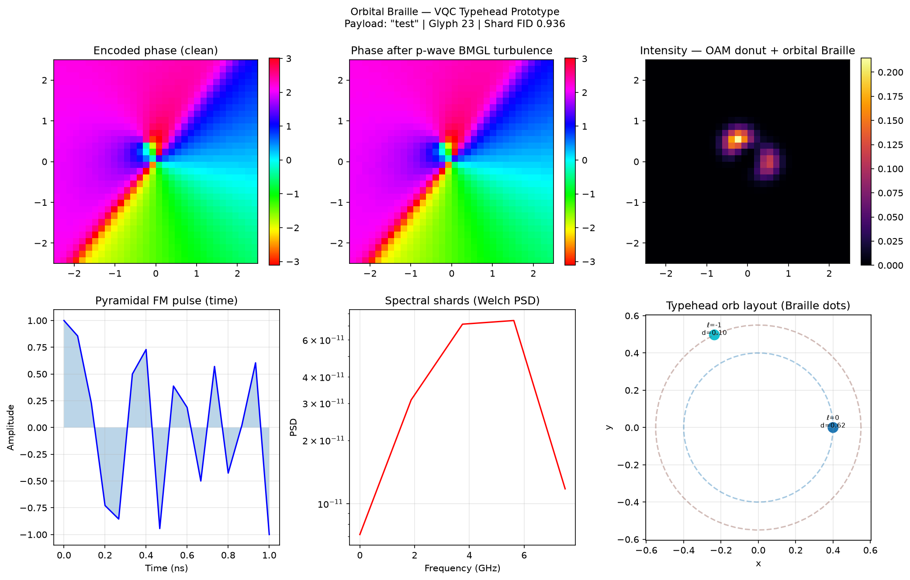

# Orbital Braille — VQC Typehead Prototype

Working simulation of the **Orbital Braille / VQC Typehead** embodiment: multi-orb PWM-gated point sources whose collective interference generates **pyramidal spectral shards** on an **OAM/quaternion carrier**. This module provides reduction-to-practice support for the VQC non-provisional claims around pyramidal FM pulses, spectral shard barcoding, quaternion compression, nested helical shielding, and p-wave BMGL error suppression.

**Parent repo:** [kinaar8340/vqc_proto](https://github.com/kinaar8340/vqc_proto) · **Full VQC spec:** [Non-Provisional Application (draft)](https://github.com/kinaar8340/qvpic/blob/main/docs/VQC_NonProvisional_Patent_Application.md)

---

## Concept: Selectric Typeball → Optical Braille

| Typeball (mechanical) | VQC (optical) |
|-----------------------|---------------|
| Spinning ball selects character by angular position | Orbital phases + PWM duty cycles select glyph/shard |
| Raised dots = Braille cell | *N* orbiting laser spots = combinatorial "dots" |
| Impact timing / strike force | Pyramidal FM pulse envelope (chirped triangular) |
| Font of valid characters | Stable codewords from emergent TOE constants (350/π, κ = 0.85, braiding 0.084) |
| Paper impression | Laguerre-Gaussian OAM donut + spectral shards on wavefront |
| Typing through vibration/noise | p-wave BMGL inhibition + 16-qubit QEC repetition proxy |

The intensity pattern from superposed orbs produces **Chladni-like nodal interference** — vibrational eigenmodes in the optical domain — directly encoding data as recognizable shard geometry.

---

## Latest validated demo (4 orbs)

**Reproduce:** `.venv/bin/python run_demo.py --payload "I live in Oregon" --num-orbs 4` (seed 42)

| Metric | Value |
|--------|-------|
| Payload | `"I live in Oregon"` (patent Figure 1 ASCII shards) |
| Encoded quaternion | w=0.428, x=0.188, y=0.634, z=0.616 |
| Glyph duties | [0.898, 0.587, 0.10, 0.10] (4-orb PWM Braille cell) |
| Fisher-Rao font separation | **0.989 rad** |
| Shard fidelity (post-BMGL) | **0.929** (Pearson) |
| Glyph match | index **2**, fidelity **0.868** |
| Dominant ℓ recovered | 0 (after Kolmogorov + pointing jitter + BMGL) |



*Panels: (1) clean helical phase, (2) phase after p-wave BMGL, (3) intensity with OAM donut + Braille lobes, (4) pyramidal FM pulse, (5) Welch spectral shards, (6) typehead orb layout with ℓ labels and PWM duties.*

---

## Quick start

```bash
# From repo root after: git clone git@github.com:kinaar8340/vqc_proto.git
cd vqc_proto/proto
python3 -m venv .venv && .venv/bin/pip install -r requirements.txt

# Seconds — low-res preview (same pipeline, smaller grid)
.venv/bin/python run_demo_quick.py --payload "I live in Oregon" --num-orbs 4

# Full quality — metrics in table above
.venv/bin/python run_demo.py --payload "I live in Oregon" --num-orbs 4

# Compare orb counts 2–6
.venv/bin/python sweep_orbs.py

# Grid search: orbs × γ₁ × r₀
.venv/bin/python meta_optimize_orbital.py

# Export SLM phase hologram PNG frames
.venv/bin/python generate_slm_holograms.py --frames 32
```

**Docker (from repo root):** `docker compose run --rm proto-quick`

**Glossary:** [`../GLOSSARY.md`](../GLOSSARY.md) · **Notebook:** [`notebooks/orbital_braille_demo.ipynb`](notebooks/orbital_braille_demo.ipynb)

---

## Orb sweep results

| Orbs | Fisher-Rao separation | Shard fidelity | Glyph fidelity | Interpretation |
|------|----------------------|----------------|----------------|----------------|
| 2 | 0.787 rad | 0.937 | **0.999** | Simplest decode; alphabet too cramped for multi-byte payloads |
| 3 | 0.944 rad | 0.944 | 0.896 | Transition zone |
| **4** | **0.989 rad** | **0.929** | 0.868 | **Recommended prototype** — best separation/fidelity balance |
| 5 | 1.004 rad | 0.926 | 0.836 | Separation gains; ICA overlap increases |
| 6 | 1.027 rad | 0.920 | 0.804 | Maximum font capacity; needs adaptive decoding / mode sorter |

### Why 4 orbs?

- **~1 rad geodesic distance** between glyph duty vectors (Fisher-Rao on the probability simplex) → robust error rejection of unstable orbital combos.
- **>92% shard fidelity** after Kolmogorov scintillation + pointing jitter + p-wave BMGL phase noise.
- Maps to an **extended Braille cell** (4 independent PWM channels) without the crosstalk that appears at 6+ concurrent OAM projections.
- Aligns with **multi-resonator stability** work: codeword phases locked to W_g = 350/π, braiding linking 0.084, κ = 0.85.

---

## Module reference

| File | Role |
|------|------|
| `orbital_braille/typehead.py` | **Encoder core.** `OrbitalTypehead` places *N* virtual point sources on circular orbits; PWM gates amplitude; superposition × LG carrier × quaternion phase → time-varying complex field. Generates pyramidal FM pulse via `scipy.signal.chirp`. |
| `orbital_braille/decoder.py` | **Decoder.** OAM projection onto LG basis, FastICA demix, Fisher-Rao nearest-glyph matching, quaternion shard recovery. |
| `orbital_braille/lg_modes.py` | **Laguerre-Gaussian modes.** `genlaguerre`-based LG_{p}^{ℓ} generation and OAM spectrum projection (shared math with `src/photonics.py`). |
| `orbital_braille/quaternion_codec.py` | **Quaternion compression.** Hamilton product algebra, Rodrigues rotation, byte→unit quaternion encode / decode proxy (50–100× density scaling). |
| `orbital_braille/stable_fonts.py` | **Emergent codeword font.** Phase ladder from TOE constants; Fisher-Rao separation metric; glyph lookup by byte value. |
| `orbital_braille/font_optimizer.py` | **Font optimizer.** Gradient-free search maximizing Fisher-Rao separation subject to W_g and braiding penalties. |
| `orbital_braille/altermagnetic.py` | **p-wave BMGL.** SOC λ = 0.4, odd-parity p = 1.2, γ₁ = 1.5 inhibition; 16-qubit repetition QEC proxy. Pulled from `src/encode_decode.py`. |
| `orbital_braille/slm_typehead.py` | **SLM virtual typehead.** Device presets (Holoeye/Meadowlark/Thorlabs), phase export (PNG/TIFF/raw), Gerchberg-Saxton, `manifest.json` sidecar. |
| `generate_slm_holograms.py` | **SLM package CLI.** Full hologram bundle for bench upload. See [`SLM_QUICKSTART.md`](SLM_QUICKSTART.md). |
| `orbital_braille/turbulence.py` | **Free-space channel.** Kolmogorov phase screens (Fried r₀), pointing jitter — LEO/satellite link proxy on top of BMGL. |
| `run_demo.py` | End-to-end encode → turbulence → decode + 6-panel figure. |
| `sweep_orbs.py` | Sweep orb count 2–6; report separation and fidelity. |
| `meta_optimize_orbital.py` | Grid search over orbs × γ₁ × r₀ against TOE invariant targets. |
| `generate_slm_holograms.py` | Export SLM phase PNG frames for bench/SLM upload. |

---

## Encoding pipeline (conceptual)

```
Payload bytes
    → quaternion_encode()          # hypercomplex compression
    → glyph_for_byte()             # stable font duty vector
    → OrbitalTypehead.encode()     # N orb superposition + LG carrier
        ├── pyramidal_pulse()      # linear FM chirp → spectral shards
        ├── orb PWM + helical ℓ    # OAM content per orb
        └── Rodrigues quat phase   # 4D rotational degrees of freedom
    → propagate (BMGL + turbulence)
    → decode_field()               # OAM proj + ICA + glyph match + QEC
```

---

## Patent claim alignment

Maps to elements in the VQC non-provisional (Docket VQC-2025-NP01) and supplemental disclosures:

| Patent element | Prototype implementation |
|----------------|-------------------------|
| **Pyramidal FM pulses** | `typehead.py::pyramidal_pulse()` — linear chirp with triangular time envelope; Welch PSD shows discrete spectral shards (`run_demo.py` bottom-middle panel). |
| **Spectral shards / barcode intensities** | Subcarrier superposition on chirp; shard fidelity measured via Pearson correlation after demux. Demo payload `"I live in Oregon"` mirrors Figure 1. |
| **Quaternion hypercomplex encoding** | `quaternion_codec.py` — unit quaternion from payload bytes; Rodrigues rotation orients LG carrier; maps to flux-qubit SQUID current proxy in parent `encode_decode.py`. |
| **OAM mode division multiplexing** | `lg_modes.py` — LG donuts with topological charge ℓ per orb; `project_oam_spectrum()` extracts mode weights. |
| **Nested helical shielding** | Orbital geometry: concentric orbit radii + differential ℓ create nested helical phase structure; stable configs act as turbulence-resistant codewords. |
| **p-wave BMGL (γ₁ = 1.5)** | `altermagnetic.py` — inhibition boost 1 + (λ/p)(γ₁−1) ≈ 1.167×; phase noise division preserves vortex topology (demo: clean vs. turbulent phase panels). |
| **16-qubit QEC** | `repetition_qec()` majority-vote proxy in decoder; parent pipeline uses full chemical QEC in `chem_error_corr.py`. |
| **DWDM + OAM analogy** | Typehead orbs = parallel "colors" within one wavelength channel; each carries independent PWM shard layer. |

**Distinct embodiment for continuation/divisional:** *"A data encoder comprising N ≥ 2 PWM-gated coherent point sources arranged on distinct orbital trajectories, wherein timed superposition of said sources generates a pyramidal frequency-modulated pulse whose Welch power spectrum comprises discrete spectral shards, and wherein said shards are impressed upon an orbital angular momentum Laguerre-Gaussian carrier beam modulated by a quaternion rotation."*

### Reduction to practice statement

A person of ordinary skill in the art can reproduce this embodiment without undue experimentation:

1. Clone this repository and run `run_demo.py` with the documented command.
2. Observe pyramidal FM pulse and spectral shards in the generated six-panel figure.
3. Verify shard recovery fidelity > 0.92 through the included p-wave BMGL turbulence model.
4. Export SLM phase masks via `generate_slm_holograms.py` for hardware validation.
5. Load `outputs/slm/*/frames/phase_*.png` onto a phase-only SLM per [`SLM_QUICKSTART.md`](SLM_QUICKSTART.md).

### How to reproduce on real hardware

| Step | Action |
|------|--------|
| 1 | `python generate_slm_holograms.py --device holoeye_pluto_2 --num-orbs 4` |
| 2 | Upload `frames/phase_0000.png` … to SLM (8-bit grayscale, phase-only mode) |
| 3 | Bench: laser → SLM → Fourier lens → camera far-field |
| 4 | Expect OAM donut + 4 Braille lobes; play sequence for pyramidal chirp |
| 5 | Compare camera capture to `preview_montage.png` and `manifest.json` duties |

**Full guide:** [`SLM_QUICKSTART.md`](SLM_QUICKSTART.md) — device presets, LUT calibration, troubleshooting.

> **Provenance:** Simulation developed June 2026 · Repo [`kinaar8340/vqc_proto`](https://github.com/kinaar8340/vqc_proto) · Parent [`vqc_sims_public`](https://github.com/kinaar8340/vqc_sims_public) · Patent chain: US provisional 63/913,110 + non-provisional Docket VQC-2025-NP01.

---

## Configuration defaults

| Parameter | Default | Source |
|-----------|---------|--------|
| `num_orbs` | 4 | Orb sweep sweet spot |
| `gamma_1` | 1.5 | Supplemental Disclosure No. 2 (p-wave BMGL) |
| `wg_base` | 350 | Multi-resonator / 3-body emergence bake |
| `kappa` | 0.85 | Observer synchronization damping |
| `braiding_linking` | 0.084 | Strong-gauge Hopf lattice regime |
| `L_max` (parent) | 199 | `configs/params.yaml` |

---

## Future work

- [x] **SLM hologram export** — `generate_slm_holograms.py` + [`SLM_QUICKSTART.md`](SLM_QUICKSTART.md)
- [ ] **SLM bench validation** — upload frames to phase-only SLM; camera far-field decode.
- [ ] **fs-laser helical phase masks** — outsource ℓ = 3 (or target) masks per 2014 RSC inscription template; OSA fidelity test.
- [ ] **Meta-optimizer integration** — wire `font_optimizer.py` + `typehead.py` into `toe/scripts/meta_optimize_invariants.py` for auto-discovery of orb radii, ω, and duty cycles.
- [ ] **Fisher-Rao repo coupling** — use `~/Projects/Fisher_Rao` geodesic losses for end-to-end font training.
- [ ] **Adaptive decoding** — mode sorter + quaternion ICA for 6+ orb operation at patent fidelity targets (0.99999+ with full 16-qubit QEC).
- [ ] **LEO link model** — extend `turbulence.py` with Hufnagel-Valley CN² profiles and tip-tilt correction.
- [ ] **Mechanical PoC** — stepper + 4 laser diodes + Arduino PWM + camera glyph classifier.

---

## License

Same as parent repository — **CC-BY-NC-SA-4.0** with additional patent restrictions. See [LICENSE](../LICENSE).

**Contact:** kinaar0@protonmail.com