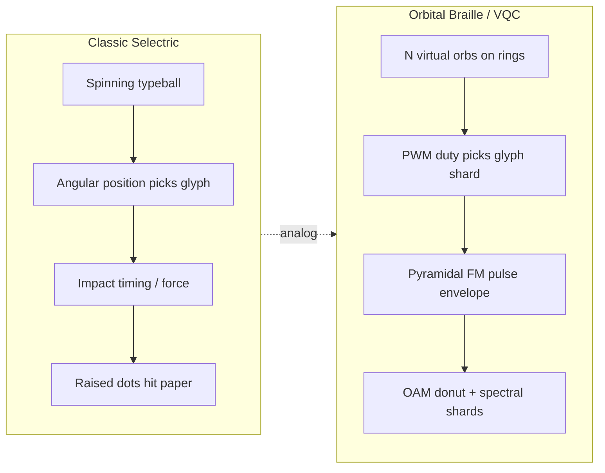
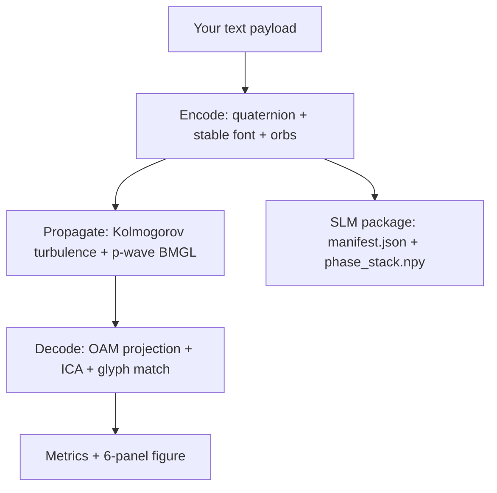

# Orbital Braille — VQC Typehead

  

**Beginner-friendly browser demo** of the Orbital Braille prototype: several virtual laser “dots” orbit like a typeball, their timed flashes (PWM) imprint data as **spectral shards** on an **OAM (orbital angular momentum)** light beam.

No install required — use the **App** tab above. This page explains what you are looking at.

---

## In 60 seconds: what is this?

Think of an **IBM Selectric typeball**, but optical:

1. **Characters** are not metal letters — they are **PWM duty patterns** on *N* orbiting spots (like Braille dots on a spinning ball).
2. The spots **interfere** on a shared **Laguerre-Gaussian (LG) donut beam** carrying OAM (helical phase, topological charge ℓ).
3. A **pyramidal FM pulse** (triangular envelope + chirp) turns the payload into **discrete spectral shards** — a barcode in frequency.
4. A **quaternion** compresses the byte stream onto the carrier rotation.
5. **p-wave BMGL** (γ₁ slider) models how the decoder fights phase noise — like typing on a vibrating desk.

The demo runs the full encode → turbulence → decode loop and shows a **6-panel figure** plus an optional **SLM hardware export zip**.

---

## Watch the typehead process

  <video src="https://raw.githubusercontent.com/kinaar8340/vqc_proto/main/docs/typehead_screencast.mp4" controls width="100%" style="max-width: 900px; border-radius: 8px;"></video>

*Recorded walkthrough of the live Space: **Animate typehead** after **Run demo** — helical phase, OAM intensity, pyramidal pulse, PWM orbs (payload: `"I live in Oregon"`).*

  

---

## Typeball analogy (mechanical → optical)

---

## Pipeline (what happens when you click Run demo)

| Step | Plain English |
|------|----------------|
| **Encode** | Turn text into orb positions, PWM duties, and a unit quaternion on the LG carrier. |
| **Propagate** | Add realistic-ish channel noise (turbulence + BMGL phase noise). |
| **Decode** | Recover glyph and shard fidelity from the noisy field. |
| **SLM export** | Optional zip for phase-only SLM benches (see accordion in the app). |

---

## How to use this Space (step by step)

1. Open the **App** tab (top of this page).
2. Enter a **payload** or click **Load example from paper** → `"I live in Oregon"` (patent Figure 1).
3. Set **Number of orbs** — **4** is the validated sweet spot (best separation vs. fidelity).
4. Choose **Quick** (fast preview) or **Full** (publication-quality grid).
5. Adjust **γ₁** (p-wave BMGL strength) — higher = stronger noise inhibition in the model.
6. Optionally check **Include SLM-ready phase frames** for PNG sequences in the zip.
7. Click **Run demo** → read **Metrics**, view the **6-panel output**.
8. Click **Animate typehead** → per-run GIF (phase · intensity · pulse · orb trails) — unique to your payload/settings.
9. Expand **SLM package download** → file list + `slm_package.zip`.

---

## Reading the 6-panel output

| Panel | What it shows |
|-------|----------------|
| **Top-left** | Clean encoded phase (helical OAM structure). |
| **Top-middle** | Phase after BMGL + turbulence (compare to γ₁ slider). |
| **Top-right** | Intensity — OAM donut with Braille-like lobes. |
| **Bottom-left** | Pyramidal FM pulse in time (triangular chirp). |
| **Bottom-middle** | Welch PSD — discrete **spectral shards** (barcode). |
| **Bottom-right** | Typehead layout — orb rings, ℓ charges, PWM duties. |

---

## Key terms (mini glossary)

| Term | One-line meaning |
|------|------------------|
| **OAM** | Twisted light — beams with helical phase; ℓ is the “twist number.” |
| **LG mode** | Laguerre-Gaussian beam — standard math for OAM donuts. |
| **PWM** | Pulse-width modulation — each orb is ON/OFF over time to encode a duty vector. |
| **Spectral shards** | Sharp peaks in the pulse spectrum — subcarrier barcode for the payload. |
| **Quaternion** | 4-number rotation code compressing payload bytes onto the carrier. |
| **BMGL / γ₁** | Beam-Motion-Gated Learning — error inhibition; γ₁ tunes suppression strength. |
| **Fisher-Rao separation** | How distinct glyph codewords are in PWM space (higher = safer decode). |
| **SLM** | Spatial light modulator — chip that displays phase holograms for real optics. |

Full glossary: [GLOSSARY.md](https://github.com/kinaar8340/vqc_proto/blob/main/GLOSSARY.md)

---

## How this compares to existing OAM work

| Approach | Typical goal | What Orbital Braille adds |
|----------|--------------|---------------------------|
| **Allen et al. — OAM modes** (1992) | ℓ modes as orthogonal channels | Time-multiplexed **virtual typehead** orbs + PWM glyph font on one carrier |
| **OAM + DWDM multiplexing** (Willner group, etc.) | Many spatial modes per wavelength | **Pyramidal FM spectral shards** as an extra barcode layer + quaternion compression |
| **SLM OAM holograms** | Static ℓ hologram on phase SLM | **Animated phase stack** + `manifest.json` bench sidecar (Holoeye / Meadowlark / Thorlabs notes) |
| **OAM mode sorters** (log-polar, etc.) | Hardware demultiplex by ℓ | Simulation path: OAM projection + **FastICA** + Fisher-Rao nearest glyph |
| **Orbital-angular-momentum communications demos** | Bessel/LG basis channels | **BMGL turbulence proxy**, shard fidelity metric, patent-aligned Figure 1 payload |
| **Classical coherent ISI/OFDM** | Frequency subcarriers | Chirped **pyramidal** envelope tying shards to physical typehead timing |

Orbital Braille is a **research prototype** for the [VQC (Vortex Quaternion Conduit)](https://github.com/kinaar8340/vqc_proto) architecture — not a drop-in replacement for commercial OAM links, but a distinct embodiment combining typeball-like coding, OAM carriers, and exportable SLM artifacts.

---

## Example payloads

| Payload | Orbs | Notes |
|---------|------|-------|
| `I live in Oregon` | 4 | Patent Figure 1 reference — use **Load example from paper** |
| `VQC prototype` | 4 | General ASCII shard test |
| `Hello OAM` | 2 | Fastest run; smaller effective alphabet |

Validated metrics (4 orbs, full mode, seed 42): Fisher-Rao **0.989 rad**, shard fidelity **0.929**.

---

## Going further

| Resource | Link |
|----------|------|
| Full prototype docs | [proto/README.md](https://github.com/kinaar8340/vqc_proto/blob/main/proto/README.md) |
| SLM bench quickstart | [proto/SLM_QUICKSTART.md](https://github.com/kinaar8340/vqc_proto/blob/main/proto/SLM_QUICKSTART.md) |
| Source code | [github.com/kinaar8340/vqc_proto](https://github.com/kinaar8340/vqc_proto) |
| Patent / IP | [IP_NOTICE.md](https://github.com/kinaar8340/vqc_proto/blob/main/IP_NOTICE.md) · US Provisional 63/913,110 |

---

## License

**CC-BY-NC-SA-4.0** + patent restrictions — **non-commercial research only**.

Synced from [`proto/gradio_demo.py`](https://github.com/kinaar8340/vqc_proto/blob/main/proto/gradio_demo.py) via `scripts/sync_hf_space.sh`.