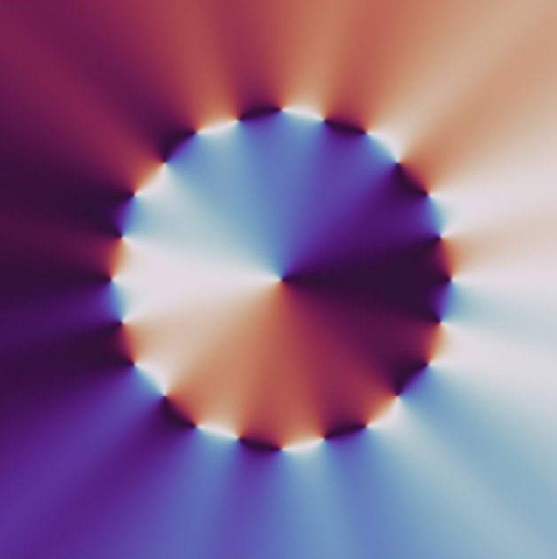

# Orbital Braille — VQC Typehead

  

Browser demo of the **Orbital Braille** prototype: *N* PWM-gated point sources whose interference imprints **pyramidal spectral shards** on an **OAM/quaternion carrier**.

## Try it

1. Enter a payload (default: `"I live in Oregon"`)
2. Set orb count (2–6; **4** is the validated prototype sweet spot)
3. Choose **Quick** resolution for sub-second runs; **Full** for publication-quality figures
4. Adjust **γ₁** (p-wave BMGL strength) if desired
5. Click **Run demo** — metrics + 6-panel figure
6. **Download SLM package** — `manifest.json` + `phase_stack.npy` (optional PNG frames)

Use **Load example from paper** for patent Figure 1 (`"I live in Oregon"`, 4 orbs).

## Example payloads

| Payload | Orbs | Notes |
|---------|------|-------|
| `I live in Oregon` | 4 | Patent Figure 1 reference |
| `VQC prototype` | 4 | General ASCII shard test |
| `Hello OAM` | 2 | Fastest decode, smaller alphabet |

## Source & license

- Live demo: [kinaar111/orbital-braille-vqc](https://huggingface.co/spaces/kinaar111/orbital-braille-vqc)
- GitHub: [kinaar8340/vqc_proto](https://github.com/kinaar8340/vqc_proto)
- **CC-BY-NC-SA-4.0** + patent restrictions — non-commercial research only
- US Provisional Patent 63/913,110

Synced from `proto/gradio_demo.py` via `scripts/sync_hf_space.sh`.
